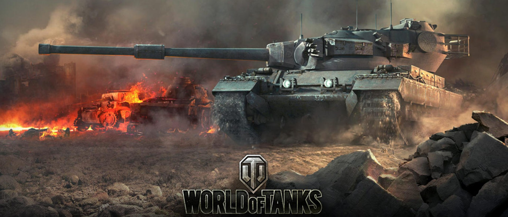

```{r setup, include=FALSE}
knitr::opts_chunk$set(echo = FALSE)

library("vembedr")

# Learn more about creating websites with Distill at:
# https://rstudio.github.io/distill/website.html

```



## Questions that will be answered

This analysis will be primarily focused on the individual win rates for each tank although other statistics may be considered and mentioned. The data scraped will provide a tank's nationality, class, tier, and if they are a premium tank. On top of this, the data provides win rates and player counts for each individual server. Using this data, this project will seek to:

* Observe and determine differences in player counts and win rates by server
* Determine differences in win rates based on different characteristics (tier/type/nation)
* Determine whether there is a balancing issue regarding premium tanks (do they have an unfair advantage)
* Determine any particularly strong tanks and what characteristics they possess


## About World of Tanks

### World of Tanks Gameplay

World of Tanks is a massively multiplayer online (MMO) game created by Wargaming. Released August 12, 2010 it continues to support relatively strong player counts. In World of Tanks, players take control of a single armored tank of their choice, and is placed into a battle on a random map. The player has control over the vehicle's movement, firing, and can communicate with allied players and all the other players through typed or voice chat. A simple random match is won either by destroying all vehicles on the opposing team or capturing the opposing team's base by staying in it for long enough without being damaged by another tank. 

```{r}
embed_url("https://www.youtube.com/watch?v=68orlULGqIA")
```

Video demonstrating World of Tanks gameplay

### The Tanks in the Game

In World of Tanks, vehicles are modeled to closely resemble their counterparts in real life. For game balance and for better ease of play, certain tank parameters have been simplified or modified from their actual historical values. World of Tanks has five different types of vehicles: light tanks, medium tanks, heavy tanks, tank destroyers, and artillery. The game currently includes over 600 armored vehicles from Britain, China, Czechoslovakia, France, Germany, Italy, Japan, Poland, the Soviet Union, Sweden, and the United States. Additional premium and collectors' vehicles are available for real world currency.

### About the Data

This data was scraped from the Wot-News website. This website pulls data from Wargamings servers in order to provide data on server activity and tank statistics. This is updated weekly and this project will take data from the last 60 days. This data can all be viewed on the Wot News website at: https://wot-news.com/.
Some data that wasn't included on Wot News such as whether a tank was a premium tank or not was manually added.


